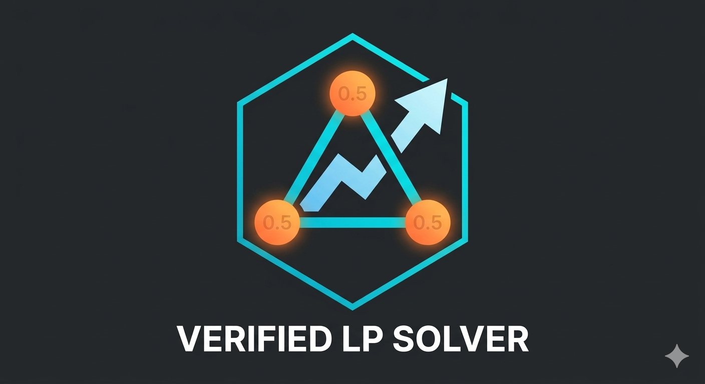

# Acoperire cu Vârfuri Ponderate — Aproximare LP de Factor 2

> Aplicație web interactivă pentru vizualizarea și rezolvarea problemei **Acoperirii cu Vârfuri Ponderate** prin relaxare liniară (LP) și rotunjire, obținând o soluție aproximată cu factorul garantat **2**.

---


 

---


## Despre proiect

Problema **Acoperirii cu Vârfuri Ponderate** (*Weighted Vertex Cover*) este una dintre problemele clasice NP-dificile din teoria grafurilor: dat un graf neorientat cu vârfuri ponderate, găsește o submulțime de vârfuri de greutate totală minimă astfel încât fiecare muchie să aibă cel puțin un capăt în submulțime.

Această aplicație implementează și vizualizează algoritmul de **2-aproximare bazat pe relaxare LP**:

1. Se formulează problema ca un **program liniar întreg** (ILP).
2. Se **relaxează** constrângerile de integralitate, obținând un LP continuu.
3. LP-ul se rezolvă exact prin **metoda Simplex cu Big-M**, implementată nativ în browser.
4. Orice vârf cu valoarea LP **≥ 0.5** este inclus în acoperire — rezultând o soluție validă cu cost de cel mult **2 × OPT**.

---

## Funcționalități

### Construirea grafului
| Acțiune | Efect |
|---|---|
| `Click` pe canvas | Adaugă un nod nou cu greutate aleatoare (1–25) |
| `Shift + Click` pe două noduri | Conectează nodurile printr-o muchie |
| `Shift + Click` pe o muchie | Șterge muchia |
| `Ctrl + Click` pe un nod | Editează greutatea nodului |
| `Trage` un nod | Mută nodul pe canvas |

### Rezolvare
- **Rezolvă LP** — rulează algoritmul Simplex și calculează soluția LP relaxată; nodurile din acoperire sunt evidențiate în verde
- **Greutăți Aleatoare** — atribuie greutăți noi aleatorii tuturor nodurilor, păstrând structura grafului
- **Șterge Graful** — resetează complet aplicația

### Panoul LP (stânga)
Formularea problemei se actualizează în timp real pe măsură ce graful este construit:
```
MINIMIZEAZĂ
  w₁·x₁ + w₂·x₂ + ... + wₙ·xₙ

CU RESTRICȚIILE
  xᵤ + xᵥ ≥ 1   ∀ (u,v) ∈ E

MARGINI
  0 ≤ xᵢ ≤ 1   ∀ i ∈ V
```
După rezolvare, panoul afișează valoarea fiecărei variabile, mulțimea acoperirii și garanția teoretică `2-APROX ≤ 2 × OPT_LP`.

---

## Fundament teoretic

### Semi-integralitate
Prin **Teorema Semi-integralității**, orice soluție optimă a relaxării LP pentru această problemă are toate valorile în mulțimea `{0, 0.5, 1}`, indiferent de greutăți. Acest lucru este o proprietate a **matricei de incidență a grafului**, nu a obiectivului.

### Când apar valori fracționare?
Valorile `0.5` apar **exclusiv în prezența ciclurilor impare**. Grafurile bipartite (fără cicluri impare) au întotdeauna soluții LP întregi. Cel mai simplu exemplu:

- **Triunghi cu greutăți egale** — soluția LP optimă este `x₁ = x₂ = x₃ = 0.5`; acoperirea 2-aproximată include toate 3 nodurile (cost `3w`), față de optimul întreg de 2 noduri (cost `2w`)

### Garanția de aproximare
$$\text{cost}(\text{acoperire}) = \sum_{i : x_i \geq 0.5} w_i \leq 2 \sum_{i} w_i x_i^* = 2 \cdot \text{OPT}_{LP} \leq 2 \cdot \text{OPT}$$

---

## Implementare

Aplicația este un **fișier HTML unic**, fără dependențe externe sau framework-uri — totul rulează direct în browser.

### Rezolvator LP — Simplex Big-M
Implementat de la zero în JavaScript. Forma standard folosită:

- **Variabile de surplus** `s_e` pentru restricțiile de acoperire (`≥ 1`)
- **Variabile slack** `sl_i` pentru marginile superioare (`≤ 1`)
- **Variabile artificiale** `a_e` penalizate cu `M = 10⁸` în funcția obiectiv, pentru a forța o soluție inițială bazică fezabilă

Pivotarea urmează **regula celui mai negativ cost redus** pentru selecția coloanei și **testul raportului minim** pentru selecția rândului.

### Structura codului
```
vertex-cover.html
├── <style>        — interfață grafică (CSS variabile, layout flex, animații)
├── <canvas>       — desenarea grafului (noduri, muchii, grile, efecte hover)
├── Stare globală  — G { noduri, muchii, sel, sol, acoperire }
├── Interacțiune   — mousedown / mousemove / mouseup (drag, click, Shift, Ctrl)
├── Editor popup   — modificare greutăți la Ctrl+Click
├── randeazaLP()   — generare dinamică a formulării LP în HTML
├── randeazaSolutie() — afișare rezultate și acoperire
└── rezolvaLP()    — implementare Simplex Big-M (minimizare)
```

---

## Utilizare

Nu necesită instalare. Deschide `vertex-cover.html` în orice browser modern.

```bash
# Clonează și deschide direct
git clone https://github.com/utilizator/vertex-cover-lp
cd vertex-cover-lp
open vertex-cover.html
```

---

## Cerințe

- Browser modern cu suport Canvas 2D și ES6+ (Chrome, Firefox, Safari, Edge)
- Conexiune la internet pentru fonturile Google Fonts (`JetBrains Mono`, `Syne`) — opțional, aplicația funcționează și cu fonturi de rezervă

---


